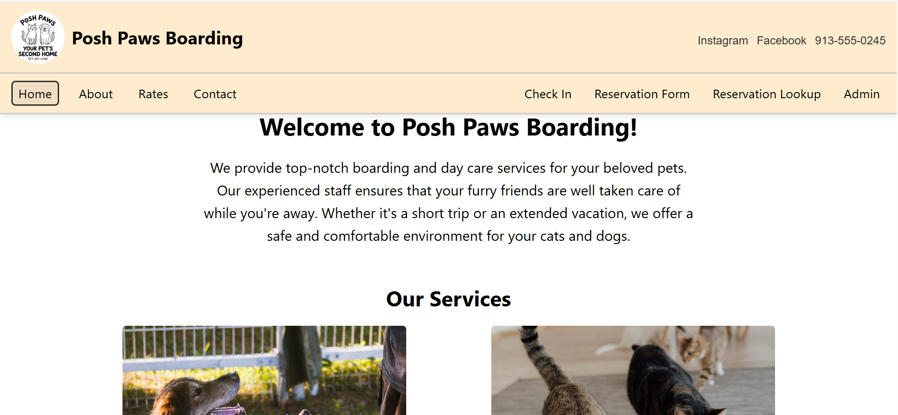
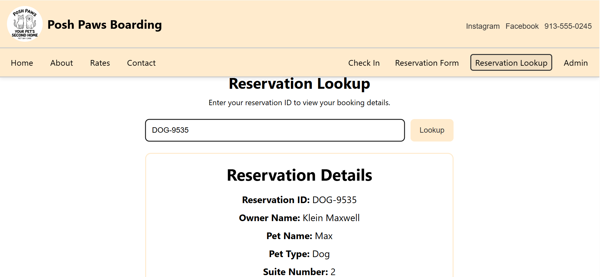

# Computer Science Capstone  
### CS-499 | Southern New Hampshire University

---

## Overview

Welcome to my Computer Science Capstone ePortfolio. This portfolio showcases my growth throughout the Computer Science program at SNHU through the enhancement of a single artifact: the **IT 145 Pet Boarding System**.

Originally developed as a Java-based object-oriented program, this artifact has been transformed into a **full-stack web application** using modern technologies, including React, Node.js, Express, and MongoDB. Each section of this portfolio demonstrates my ability to apply key computer science concepts in software engineering, algorithms, and database design.

---

## Code Review

My development process began with an informal code review, where I analyzed the original artifact, identified limitations, and planned enhancements across three core computer science categories.

🔗 **[Watch Code Review Video](#)**

---

## Artifact Overview

**Artifact:** IT 145 Pet Boarding System  
**Enhancement Approach:** Single artifact enhanced across all three categories

---

## Software Engineering and Design

The artifact was enhanced from a static, object-oriented Java program into a dynamic full-stack application. This included implementing modular architecture, reusable React components, and a responsive user interface.

  

🔗 **[View Software Engineering Enhancement](./software-engineering/)**

---

## Algorithms and Data Structures

This enhancement focused on improving efficiency and functionality through the implementation of algorithms such as reservation searching, sorting, and a suite assignment algorithm for managing pet boarding capacity.

  

🔗 **[View Algorithms & Data Structures Enhancement](./algorithms/)**

---

## Databases

The system was enhanced by integrating MongoDB, transforming it from an in-memory application into a persistent full-stack system. CRUD functionality was implemented to allow users and administrators to create, update, and delete reservations.

  

🔗 **[View Database Enhancement](./databases/)**

---

## Professional Self-Assessment

My professional self-assessment reflects on my growth throughout the Computer Science program, highlighting my development in software engineering, algorithms, databases, security, and communication.

🔗 **[View Professional Self-Assessment](./self-assessment/Calvin-Self-Assessment.md)**

---

## Skills Demonstrated

- Full-stack software development (MERN stack)
- Algorithm design and implementation (search, sort, optimization)
- Database integration and CRUD operations
- Responsive UI/UX design
- API development and client-server communication
- Debugging, testing, and code refinement

---

## Course Outcomes Alignment

This portfolio demonstrates the achievement of the five core Computer Science program outcomes through the enhancement of the IT 145 Pet Boarding System.

### Outcome 1: Collaborative Environments
I applied collaborative development practices by structuring the application using modular design principles and separating concerns between frontend, backend, and database layers. This approach supports team-based development and scalability.

### Outcome 2: Professional Communication
This ePortfolio demonstrates my ability to communicate technical concepts clearly through written narratives, organized documentation, and structured presentation of artifacts. Each enhancement is explained clearly for both technical and non-technical audiences.

### Outcome 3: Algorithms and Data Structures
I designed and implemented algorithms for reservation searching, sorting, and suite assignment. These improvements increased the efficiency and functionality of the system while demonstrating practical application of algorithmic principles.

🔗 [View Algorithms Enhancement](./algorithms/)

### Outcome 4: Software Engineering and Implementation
I developed a full-stack application using React, Node.js, Express, and MongoDB. This demonstrates my ability to use modern tools and technologies to design and implement a complete software solution.

🔗 [View Software Engineering Enhancement](./software-engineering/)

### Outcome 5: Security Mindset
I implemented basic security practices like input validation, controlled API access, and structured data handling. These practices help protect user data and ensure more reliable system behavior.

🔗 [View Database Enhancement](./databases/)
