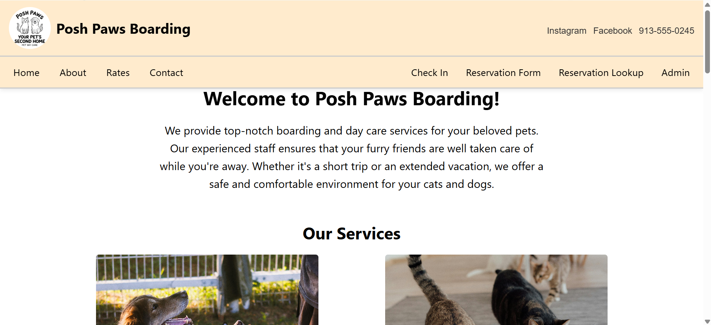

# 
Computer Science Capstone

## 
CS-499 | SNHU

### CODE REVIEW

A code review is an analytical examination of code conducted throughout the development process of an application to identify and reduce errors in code. This practice of reviewing code is important for computer science professionals because it improves accountability among the team. Reviewing code improves quality, reliability, and saves time for future development without any concern for errors in previously implemented code. 

<code> My code review of the planned artifact enhancement: <a href="#">Video</a>.</code>

<code><strong>All three categories are fulfilled using one artifact.</strong></code>

### Category 1: Software Engineering and Design

For category one, I selected the IT 145 Pet Boarding System, originally written in Java. 
The artifact was enhanced from a static, object-oriented program to a dynamic, full-stack application, incorporating modular design, reusable components, and an improved user interface.

  

<code>View the artifact's code and narrative <a href="">here</a></code>

### Category 2: Algorithms and Data Structures

For category two, I enhanced the algorithm and data structure used in IT 145 Pet Boarding System.
The artifact was enhanced by implementing search and sort algorithms, efficient data handling, and a suite assignment algorithm.

  <a href="">Screenshot of the application's reservation search results</a>

<code>View the artifact's code and narrative <a href="">here</a></code>

### Category 3: Databases

For category three, I used IT 145 Pet Boarding System.
This artifact was enhanced from an in-memory application to a dynamic system backed by MongoDB. I also implemented CRUD functionality and integration between the frontend user interface, backend, and database layers.

  <a>Screenshot of the application's admin page</a>

<code>View artifact's category three narrative and code <a href="">here</a></code>

## Professional Self-Assessment

- <code>Course Outcome 1</code>:
- <code>Course Outcome 2</code>:
- <code>Course Outcome 3</code>:
- <code>Course Outcome 4</code>:
- <code>Course Outcome 5</code>:
